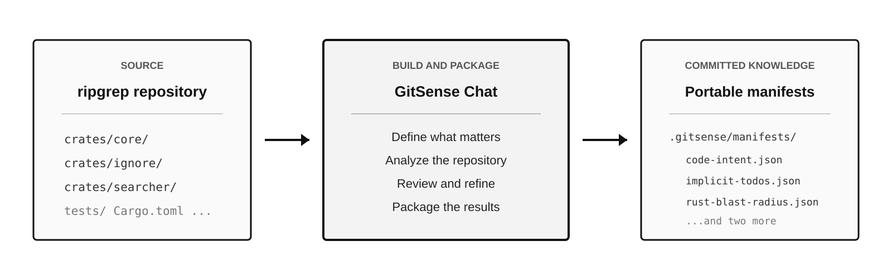
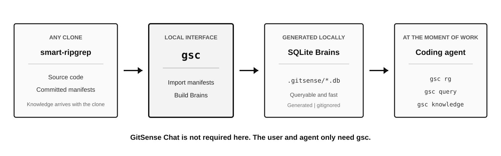

# smart-ripgrep

**See what changes when a repository remembers what agents learn.**

This is the [ripgrep](https://github.com/BurntSushi/ripgrep) codebase with GitSense knowledge committed alongside it. Follow one realistic task to see how an agent finds the right files, checks what earlier work uncovered, and avoids a plausible design mistake.

## Build Repository Knowledge



[GitSense Chat](https://github.com/gitsense/chat) was used to analyze ripgrep and package five kinds of repository knowledge. The results live in `.gitsense/manifests/` as plain JSON and travel with the code.

## Use It Locally



Once those files are committed, GitSense Chat is no longer in the path. Anyone who clones this repository can use `gsc` to build local SQLite Brains and make the knowledge available to a coding agent. At this point, the user and agent only need `gsc`.

## Turn Knowledge into Session Insights

GitSense can also attach repository knowledge to an agent session. The `risk-session-review` Analyzer combines file purpose, risk, dependency, test-coverage, and lesson metadata into structured review items for files the agent reads, edits, or writes.

This lets a reviewer see not only which files changed, but what the repository already knows about those files. The Analyzer is deterministic: it combines existing metadata without making another AI request. A surfaced lesson indicates that guidance is available for review; it does not prove that the agent consulted or followed it.

See the [`risk-session-review` documentation](.gitsense/analyzers/risk-session-review/README.md) for installation, building, and Pi session export instructions.

## One Task, Two Better Decisions

The walkthrough follows one reasonable request:

> Add a `--max-filesize-warning` flag so users know when a large file is skipped.

ripgrep is small and well organized. Finding files is not hard. The useful part is knowing which files matter and what somebody already learned about the change.

### 1. Find the Right Files

Plain ripgrep finds ten files that mention `filesize`:

```bash
rg -l filesize
```

That is a manageable list, but the agent still has to open files to learn why each match exists. The Code Intent Brain adds that missing context:

```bash
gsc rg filesize \
  --db code-intent \
  --fields purpose \
  --summary
```

Two files stand out:

| File | Why it matters |
| :--- | :--- |
| `crates/ignore/src/walk.rs` | Owns traversal and the point where oversized files are skipped. |
| `crates/core/flags/lowargs.rs` | Owns low-level CLI arguments, flag modes, and defaults. |

The agent has a better starting point before opening either file.

### 2. Check What the Repository Remembers

Finding the files is the easy part. Before changing anything, ask your coding agent:

> Check whether this repository has any lessons about max-filesize warnings. Do not make changes yet.

After `gsc experts init`, the agent knows this repository has a Lessons Brain and how to query it. It finds that this work was already investigated:

- Do not add a one-off `--max-filesize-warning` flag.
- Use the existing `ignore_message!` path, which already respects `--no-messages`.
- Preserve the crate boundary: `crates/ignore` cannot emit through a macro owned by `crates/core`.

That changes the plan before a line is written. Search found the area; saved knowledge prevented the wrong implementation.

## Try It

Install `gsc`, clone the repository, and build the two Brains used above:

```bash
# Read the install script before running it
curl https://raw.githubusercontent.com/gitsense/chat/refs/heads/main/install.sh | bash

git clone https://github.com/gitsense/smart-ripgrep
cd smart-ripgrep

gsc manifest import .gitsense/manifests/code-intent.json
gsc lessons build --target repo
```

Then ask your coding agent:

```text
Run `gsc experts init`, then investigate how you would add a
--max-filesize-warning flag. Check repository lessons before proposing changes.
```

`gsc experts init` tells the agent which Brains are available and how to query them. You can keep speaking to the agent in plain language from there.

## Keep What the Next Agent Should Know

The max-filesize lesson exists because an earlier session saved it. When your work uncovers something that should not be rediscovered, tell the agent:

> Save what we learned about max-filesize warnings as a repository lesson.

`gsc` gives the agent a structured and validated way to record it. Repository lessons live in `.gitsense/lessons/records.jsonl`, so everyone who clones the repository inherits them.

## Explore the Other Brains

This repository includes five GitSense Chat manifests. These manifests and Brains provide the source knowledge; the optional `risk-session-review` Analyzer combines that knowledge into a session-review view:

| Brain | A question it can help answer |
| :--- | :--- |
| `code-intent` | Which files are responsible for this behavior? |
| `agent-file-triage` | Which matching files are risky, and which can I skip? |
| `implicit-todos` | Where did developers describe unfinished work without writing `TODO`? |
| `rust-blast-radius` | What depends on this Rust file before I change it? |
| `rust-test-coverage-intent` | Where might behavior be missing focused test coverage? |

Import another Brain with its committed manifest:

```bash
gsc manifest import .gitsense/manifests/implicit-todos.json
```

Then ask your agent a matching question. It can inspect the Brain and choose the fields it needs.

## About This Repository

This is a GitSense learning repository built from an unchanged copy of ripgrep. The source code belongs to the upstream project. To use ripgrep, report an issue, or contribute, visit [BurntSushi/ripgrep](https://github.com/BurntSushi/ripgrep).

- [Knowledge discovery and topics](docs/knowledge-discovery.md)
- [smart-codex](https://github.com/gitsense/smart-codex) applies the same ideas to a much larger codebase.
- [GitSense CLI](https://github.com/gitsense/gsc-cli) records and delivers repository knowledge.
- [GitSense Chat](https://github.com/gitsense/chat) builds and refines repository knowledge at scale.

## License

The ripgrep source retains its upstream licensing. See [LICENSE-MIT](LICENSE-MIT) and [UNLICENSE](UNLICENSE).
